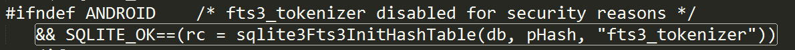

# SQLite3-ICU

#### 目的
基于ICU构造SQLite3中文分词器，用于Android App全文检索。  

#### 参考列表
1. 官方介绍， 中文分词器用到`Analysis`特性，[http://www-01.ibm.com/software/globalization/icu/index.html](http://www-01.ibm.com/software/globalization/icu/index.html)；  
2. Android内置ICU源码，不同Android版本内置不同版本ICU（不同版本ICU，源码不兼容，注意坑），[https://github.com/android/platform_external_icu4c](https://github.com/android/platform_external_icu4c)；  
3. 《Android 4.4.2 ICU 语言包 精简、裁剪、定制、本地化》，推荐文章，[http://chenggoi.com/2015/01/06/Android_ICU_Customizing/](http://chenggoi.com/2015/01/06/Android_ICU_Customizing/)；  
4. 14.04 apt-get icu52.1版本，[http://packages.ubuntu.com/trusty/libicu-dev](http://packages.ubuntu.com/trusty/libicu-dev)，但为了和Android 4.4.2 ICU49.1.1对齐，采用源码编译；  
5. ICU以及字符编码的介绍，很有意思的一篇短文，[http://www.cnblogs.com/kind064100611/p/3486771.html](http://www.cnblogs.com/kind064100611/p/3486771.html)；  
6. Android NDK 下的宽字符编码转换及icu库的使用 ，[http://blog.csdn.net/liujian885/article/details/6536897](http://blog.csdn.net/liujian885/article/details/6536897)；  
7. Android内置SQLite3不支持自定义分词器，呵呵，[https://github.com/android/platform_external_sqlite](https://github.com/android/platform_external_sqlite)；  

#### 